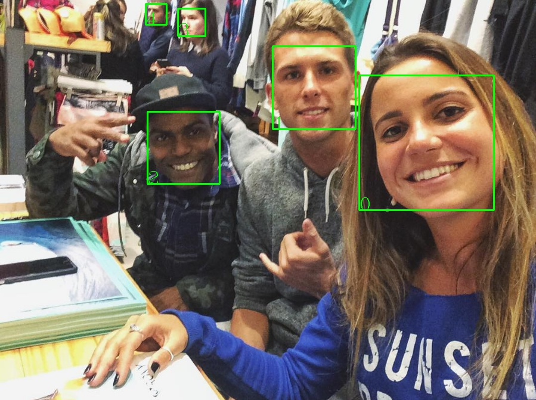
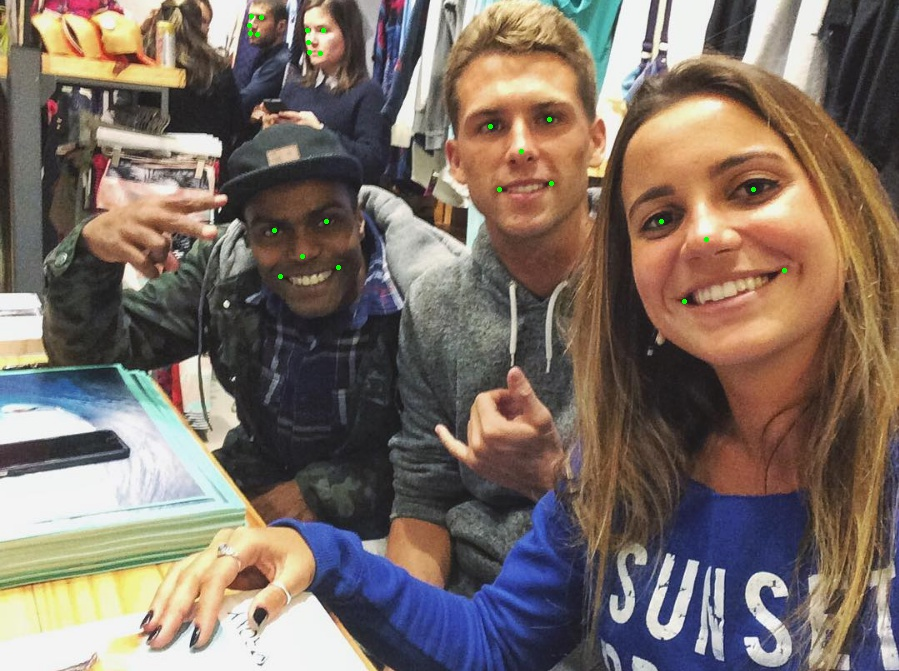
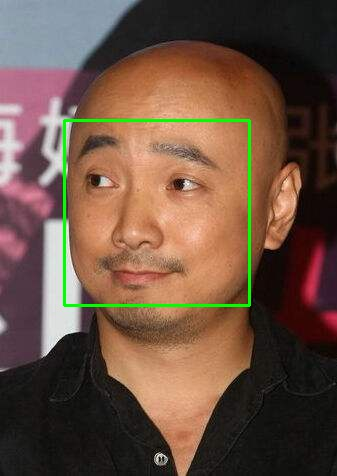
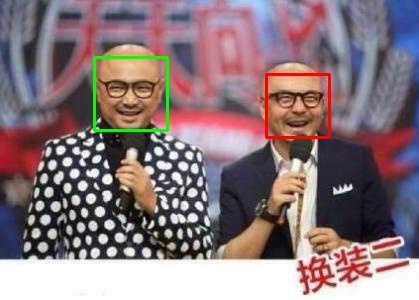

# pyseeta: python api for [SeetaFaceEngine](https://github.com/seetaface/SeetaFaceEngine.git)

[](https://travis-ci.org/gaojunying/pyseeta)
[](https://github.com/gaojunying/pyseeta/blob/master/LICENSE)

## for detection


## for alignment


## for identification
<div align='center'>
    
    
</div>

## Installation

1. Download [pyseeta](https://github.com/gaojunying/pyseeta.git)

```bash
git clone https://github.com/gaojunying/pyseeta.git
```

2. Download [SeetaFaceEngine](https://github.com/gaojunying/SeetaFaceEngine.git)

```bash
git submodule update --init --recursive
```

3. Build `SeetaFaceEngine` dynamic library.

> on unix

```bash
cd SeetaFaceEngine/
mkdir Release; cd Release
cmake ..
make  
```

> on windows

```bash
cd SeetaFaceEngine/
mkdir Release; cd Release
cmake -G "Visual Studio 14 2015 Win64" ..
cmake --build . --config Release
```

4. installation

```bash
python setup.py install
```

5. run examples

```bash
python examples/{test_opencv.py or test_pillow.py}
```

## Uninstallation

```bash
pip uninstall pyseeta
```

### Thanks
- [@TuXiaokang](http://github.com/TuXiaokang/pyseeta.git)
